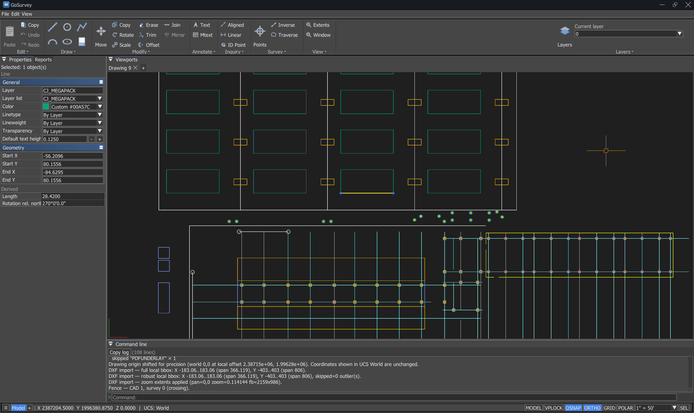
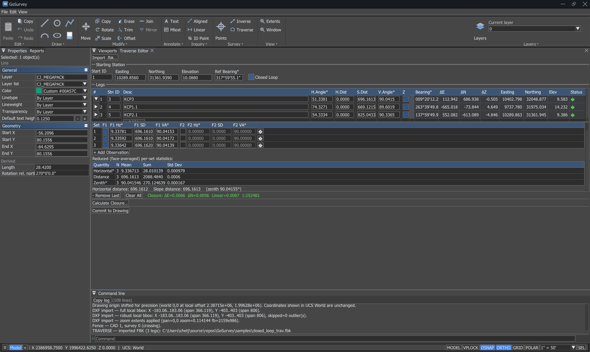
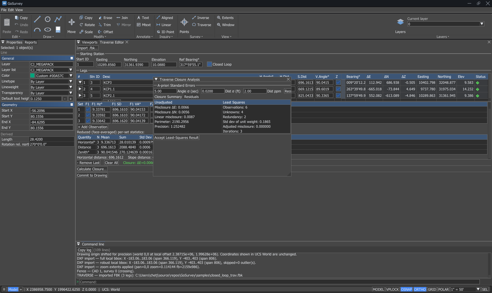
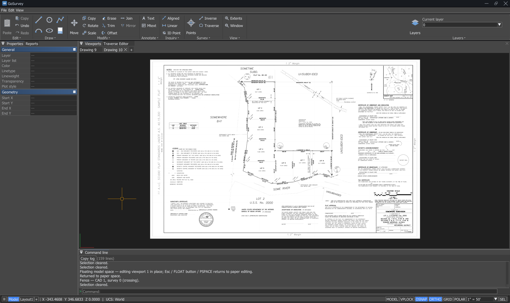

# GoSurvey

GoSurvey is a simple and modern computer-aided design (CAD) platform that provides users with powerful, easy functionality for 2D drafting and COGO needs.






---

## Download and install (Windows)

### Installer (recommended)

1. Open **[Releases](https://github.com/chetjones003/GoSurvey/releases)** for this repository.
2. Download the **`.exe` installer** from the latest release.
3. Run it and follow the wizard. GoSurvey is installed to `%ProgramFiles%\GoSurvey` by default and a Start Menu entry is created. An optional desktop shortcut is offered.
4. **SmartScreen**: Windows may show "Windows protected your PC" for apps that are not code-signed. Choose **More info → Run anyway** if you trust the release.

### Runtime requirement

If the app fails to start with a missing DLL error, install the latest **[Visual C++ Redistributable for x64](https://learn.microsoft.com/en-us/cpp/windows/latest-supported-vc-redist)** from Microsoft.

---

## Layout at a glance

- **Drawing tabs** — Multiple drawings open at once as tabs above the viewport (`Drawing 1`, `+` to add). Each tab is an independent document with its own geometry, layers, survey points, and scale.
- **Drawing viewport** — Pan with the **middle mouse button**. Zoom with the **mouse wheel** (smooth, cursor-centred). A minor grid follows the view. While a command expects a point, **dynamic input** appears at the cursor (see below).
- **Ribbon** (under the menu bar) — **Draw**, **Modify**, **Annotate**, **Inquiry**, **Survey**, and **View** blocks; hover a button for a short description and command aliases. Layer dropdown on the right.
- **Properties / Reports** (docked left) — Properties shows layer, color, linetype, lineweight, transparency, and geometry for the current selection (and **default plotted text height** for new TEXT/MTEXT). The **Reports** tab collects ALIGN, traverse, and exported-points reports.
- **Command line** (docked bottom) — Scrollable **log**, command **input** with fuzzy autocomplete, context **hints**, and a status bar with **OSNAP**, **ORTHO**, **GRID**, **POLAR**, **SEL**, annotation scale, cursor readout, and the active **UCS**.
- **Panels** — Create points, viewpoints table, CSV import/export, Traverse Editor, layer manager, and Options open as separate windows.

**Enter key**: pressing **Enter** submits the current command input from anywhere — you do not need to click the command line first.

---

## Command line and dynamic input

- **Dynamic input** — When a command expects a **coordinate point**, two live fields (X and Y) follow the crosshair showing its current **world** coordinates at the configured display precision. The active field is highlighted; **typing** locks that field to the typed value, **Tab** moves between fields, and **Enter** or a **viewport click** commits the point. Prompts that expect a bearing, angle, distance, option, or command name show a single field.
- **Autocomplete** — Typing a command name opens a suggestion popup at the cursor (nanoCAD/AutoCAD style) with fuzzy/prefix matching. Use the **arrow keys** then **Enter** (or **Tab**) to complete to the highlighted entry, or **click** a row to run it directly. **Esc** dismisses the popup.
- **Command repeat** — **Right-click** in the viewport repeats the last command. Most commands stay active for repeated use until you press **Esc**.
- **Fuzzy matching** — Typed commands match flexibly, so short or partial input resolves to the intended command.

---

## Drawing units — UNITS (`UN` / `DDUNITS`)

`UNITS` opens the **Drawing Units** dialog:

- **Display precision** — Decimal places for linear readouts (coordinates, distances, lengths) shown across the status bar, Properties, dynamic input, and reports.
- **Survey-point precision** — Independent decimal places for survey-point coordinate display and labels.
- **Angle / bearing format** — Decimal degrees, **DMS** (D°M′S″), or **Surveyor's** bearings (e.g. `N45°30′00″E`), with the direction base/sense for display. (North-is-0°, clockwise entry is unchanged — this controls **display** only.)
- **Insertion units** — The drawing unit reported as AutoCAD `$INSUNITS` on DXF export. This is a **relabel only**: coordinates are never scaled.

Display precision and angle format are user preferences; the plot scale and insertion units are stored per drawing.

---

## Angles and bearings

**North is 0°**; angles increase **clockwise** (survey convention): east 90°, south 180°, west 270°.

Applies to LINE/POLYLINE bearings, ROTATE, ALIGN, TEXT rotation, and all readouts. How angles are **displayed** (decimal degrees, DMS, or Surveyor's bearings) is set in the **UNITS** dialog; the entry convention above never changes.

---

## Drawing geometry

| Tool | Alias | What it does |
|------|-------|--------------|
| **LINE** | `L` | Segments from clicks or `X,Y`. Use `@dx,dy` for relative offsets. |
| **POLYLINE** | `PL` | Like LINE but one object. `CLOSE`/`CL` to close, `END` for open. |
| **CIRCLE** | `C` | Center then radius (or `D` + diameter). `3P` for three-point. |
| **ARC** | — | Three picks: start, point on arc, end. |
| **ELLIPSE** | `EL` | Center, major-axis end, then minor/major ratio. |
| **TEXT** | — | Insertion, height, rotation (CW from north), content. |
| **MTEXT** | `MT` | Two corners for a frame, then content. |
| **DIMALIGNED** | `DAL` | Aligned dimension: two extension points, then dimension line point. |
| **DIMLINEAR** | `DLI` | Horizontal or vertical dimension. |
| **DIMANGULAR** | `DAN` | Angular dimension between two lines. |

### LINE / POLYLINE — bearing input

After the segment anchor:

- **`A <bearing>`** — lock to a bearing; then a signed distance or a click.
- **`ANGLE`** alone — enters bearing-lock mode; type the bearing on the next prompt.
- **`AP`** / **`ANGLEPICK`** — pick two points for direction; Enter to lock, or `+90` / `-45` (decimal or DMS) to adjust first.
- **`A 45 +90`** — bearing and turn in one line.
- **`A`** alone — clear the lock.
- With **Ortho** on and no bearing lock, a **single number** is distance along H/V toward the cursor.

While in `AP` mode, **Esc** cancels only the pick, not the whole command.

### Ortho

**F8** (or status bar toggle) constrains picks and rubber-band previews to horizontal/vertical from the current anchor.

---

## Modifying and selecting

### Selection

With no command active you can:

- **Single-click** an entity to select it (entities **highlight on hover** so you can see what you'll pick).
- **Two clicks** in empty space to define a selection window. Type `SELECT` for an explicit reminder.
- When several entities overlap under the cursor, the **selection-cycling** panel lists the candidates so you can pick the right one; the **SEL** button on the status bar drives the cycle.

### QUICKSELECT (`QS`)

Build a selection set by **object property** instead of by picking. Choose an object type (line, circle, survey point, …), a property (layer, color, id, elevation, easting/northing, description, …), an operator, and a value; matching entities are selected. Value fields offer dropdowns appropriate to the property (e.g. the full named color palette, present layers).

### Grips

Selected entities show **grips** (endpoints, centres, midpoints). Drag a grip to edit geometry directly; grips honour object snap. Grip size is configurable in the Options dialog, and multiple grips can be active at once.

### Clipboard — copy / paste

- **Ctrl+C** (`COPYCLIP`) copies the current selection to the clipboard with a cursor preview.
- **Ctrl+V** (`PASTE`) places the copied objects at the cursor (with live preview before you click).
- **PASTEORIG** (`PO`) pastes at the **original** coordinates the objects were copied from.

(These are distinct from the **COPY** command below, which duplicates selected objects by a base/second point within the drawing.)

### MOVE / COPY (`M` / `CP`)

Window-select, then **base** and **second point** (or `@dx,dy`). Duplicate survey-point IDs trigger a dialog: skip, renumber, merge, or overwrite.

### ROTATE (`RO`)

Window-select, base, then angle (° CW from north, DMS allowed), or `R` for reference direction. `C` toggles copy mode.

### SCALE (`SC`)

Window-select, base, scale factor. `C` toggles copy.

### OFFSET (`O`)

Pick an entity, enter a distance (or type `T` and click through-point), then click the side to offset toward. Works on lines, circles, and arcs.

### TRIM (`TR`)

Pick cutting edges, press Enter, then click the segment halves to remove (click near the end you want gone). Type `L` for line-trim (two clicks on one edge).

### JOIN (`J`)

Window-select collinear lines or coaxial arcs/polylines that meet at endpoints; merges touching chains into single entities.

### OVERKILL (`OK`)

Cleans up the entire drawing in one pass:

- **Lines** — removes zero-length and exact-duplicate segments; merges collinear overlapping/touching segments into the shortest covering segment (union-find + 1-D interval cover).
- **Circles** — removes exact duplicates (same centre and radius within tolerance).
- **Arcs** — removes arcs whose underlying circle is already present as a full circle entity; removes exact duplicate arcs.
- **Polylines** — strips zero-length (coincident) vertex steps.

Tolerance is auto-derived: `1 × 10⁻⁴ × max(x-span, y-span)`. Removal counts are reported in the command log.

### DELETE (`DEL`)

Two-click window over geometry to remove.

---

## PDF Underlay

### Attaching a PDF (`PDFATTACH` / `PA`)

Opens the PDF Attach dialog. Choose a PDF file and page, then:

- **Specify insertion point** — click in the viewport to place, then set scale.
- **Direct insert** — enter coordinates and scale numerically.

The PDF is rasterised and displayed as a GPU texture overlay. Both light-background (white paper) and dark-background (CAD export) PDFs are supported: the background is automatically detected and made transparent so the PDF floats cleanly over your drawing at any opacity.

Multiple PDFs can be attached simultaneously. Each underlay has independent position, scale, rotation, opacity, and snap toggles.

### PDF snap

Object snap works on attached PDFs. Snap targets are detected by analysing the **rendered raster image** rather than internal PDF path structure, so snap fires at the geometry you can actually see:

- **Endpoints** — line ends, stroke terminals (1 foreground neighbour in the raster topology).
- **Corners** — bends and junctions where two lines meet at an angle (2 non-opposite neighbours).
- **Junctions** — T-intersections and crossings (3+ neighbours).
- **Midpoints** and **perpendicular** snaps are also available on PDF line segments.

This image-based approach reliably handles GIS exports, scanned drawings, and other high-density PDFs where the internal PDF path objects do not correspond to visible line geometry.

---

## View

| Command | Action |
|---------|--------|
| **ZOOM EXTENTS** (`ZE`) | Fit all geometry and markers in view. |
| **ZOOM WINDOW** (`ZW`) | Two clicks define the zoom rectangle. |
| **REGEN** (`RE`) | Refresh GPU caches if the display looks stale. |

Delete and zoom-window use **unsnapped** cursor positions.

---

## Plot scale, annotations, and display

- **Annotation scale** — Preset dropdown on the status bar (e.g. `1″ = 50′`). Same as `PLOTSCALE`/`PSCALE` on the command line (e.g. `PSCALE 50`). Controls model units per plotted inch.
- **Default text height** — Properties → General, in inches on the sheet; combined with plot scale for new TEXT/MTEXT model height.
- **REGEN** (`RE`) — Refreshes GPU caches if the display looks stale.

---

## DXF

Use **File → Import DXF…** and **File → Export DXF…** for exchange with AutoCAD, AutoCAD Civil 3D, and other DXF readers.

### Export (ASCII DXF AC1032)

Exports are **ASCII DXF** tagged AC1032 (AutoCAD 2018-class):

- **HEADER** — Drawing limits, extents, system variables, `$HANDSEED`, and (when survey points are present) `$PDMODE`/`$PDSIZE` so POINT entities display as an X.
- **TABLES** — Standard tables: LAYER (with plot-style pointers), VIEW, UCS, VPORT, APPID, DIMSTYLE, BLOCK_RECORD with canonical `*Model_Space`/`*Paper_Space` names.
- **ENTITIES** — Lines, circles, arcs, ellipses, polylines, text, mtext, aligned dimensions (as exploded lines + text), with layers, ACI colors, lineweights, and model-space ownership.
- **OBJECTS** — Minimal named-object dictionary so hosts like Civil 3D accept the file.

Survey points are written as native `POINT`/`AcDbPoint` entities at **world** coordinates (easting, northing, elevation, per-point layer and ByLayer colour). Each carries identity in `GOSURVEY` **XDATA** (point id, label style, description) so a GoSurvey-exported DXF round-trips with full survey identity, while any other DXF reader still sees a plain valid `POINT`.

### Import

Model-space geometry: lines, circles, arcs, ellipses, polylines, and common annotations. Paper space and unsupported types are skipped; the command log reports details. Large state-plane coordinates are imported at full precision (an internal local origin is set automatically) and the view zooms to extents.

**Survey points on import:**

- A `POINT` carrying GoSurvey XDATA is **reconstructed** as a survey point with its id, coordinates, elevation, description, layer, and label style, and its label is re-linked.
- A `POINT` **without** that XDATA (e.g. from another program) imports as a small snappable **cross-line** marker, unchanged.
- Importing a DXF **replaces the CAD geometry but keeps survey points already in the session**, so importing points (CSV) then a DXF — or a DXF then points — both keep all points. The DXF's reconstructed points are **merged** with the existing ones: non-colliding ids are added directly, and a colliding id prompts you to **overwrite** the existing point or **offset** the imported ids.

> **Civil 3D note:** Autodesk Civil 3D COGO points are custom objects that are *not* written as standard DXF entities, so they cannot be recovered from a plain DXF. To bring Civil 3D survey points into GoSurvey, export them from Civil 3D as a **PNEZD/PENZD CSV** and use **Import points** (below); use DXF for the linework.

---

## Survey points

World coordinates: **Easting = X**, **Northing = Y**.

| Command | Panel |
|---------|-------|
| **CREATEPOINTS** (`CRTPTS`) | Open the create-points panel and click in the drawing to place survey points. |
| **VIEWPOINTS** (`VWPTS`) | Table of points: IDs, coordinates, elevation, layer, description. |
| **IMPORTPOINTS** (`IMPPTS`) | CSV import with column presets and preview. |
| **EXPORTPOINTS** (`EXPPTS`) | CSV export with column layout options. |

### Create Points

Open the **Create points** panel (ribbon Survey → point icon, or type `CREATEPOINTS`). While the panel is open, clicking in the drawing places survey points — no separate toggle needed. Clicking on an existing marker selects it instead.

The panel lets you set the **next point ID**, default **layer**, **description**, and **elevation** for new points, and choose a **duplicate ID policy** (skip, renumber, merge, overwrite).

Survey markers participate in selection; duplicate-ID policy applies when copying or moving. Export DXF writes survey points as AutoCAD `POINT` objects so they appear in Civil 3D and similar hosts.

### View / edit points — VIEWPOINTS (`VWPTS`)

The viewpoints table lists every point with editable **ID, Easting, Northing, Elevation, Layer, Description** and a per-row delete. Coordinates are shown and edited in **world** (state-plane) values; labels using the `{north}`/`{east}` placeholders also display world coordinates. The table can save/load the survey database to JSON.

### CSV import / export — IMPORTPOINTS / EXPORTPOINTS (`IMPPTS` / `EXPPTS`)

Import and export support column-order presets:

- **P,N,E,Z,D** — point id, northing, easting, Z, description.
- **P,E,N,Z,D** — point id, easting, northing, Z, description.
- **N,E,Z** / **E,N,Z** — coordinates only; ids are assigned on import.

Import shows a **live preview** and validation summary, can **skip a header row**, and reports per-row problems in the command log. CSV coordinates are world (state-plane) values; GoSurvey converts them into the drawing's internal frame at full precision, so imported points land exactly on matching DXF geometry. Export writes world coordinates and adds a tab to **Reports**.

---

## Coordinate alignment — ALIGN (`AL`)

`ALIGN` computes and applies a **2D Helmert (similarity) transformation** — scale, rotation, and translation — from a set of source→destination control point pairs. This is the standard least-squares 4-parameter adjustment used to transform a drawing from local coordinates into a real-world coordinate system.

### Workflow

1. **Type `ALIGN` or `AL`.**

   - If entities are already selected, ALIGN uses that selection immediately and skips to step 3.
   - If nothing is selected, ALIGN asks you to **window-select** the entities to transform. Press **Enter** to confirm the selection.

2. **Pick control point pairs.** For each pair:

   - Click (or type `X,Y`) the **source** survey point in the drawing — use OSNAP to snap precisely to an existing survey marker.
   - Click or type the **destination** real-world coordinates for that point.

   Repeat for as many pairs as needed. A minimum of **1 pair** gives translation only. **2 or more pairs** fit a full Helmert (scale + rotation + translation).

3. **Press Enter to solve.** The results window opens showing the computed transformation parameters and per-pair residuals.

4. **Review and optionally remove pairs.** Click the **`-`** button on any row to remove it — the solution updates live. Use this to exclude outliers.

5. **Apply.** Choose one of:

   - **Apply Scale** (checkbox checked) — applies the full Helmert including the computed scale factor.
   - **Apply** (checkbox unchecked) — applies rotation and translation only, with scale forced to 1.0. The translation is re-derived from centroids so the solution remains least-squares optimal.

6. **Report.** A transformation report is automatically added to the **Reports** tab showing all parameters and per-pair point errors.

### Control point tagging

After applying, ALIGN automatically tags affected survey points:

- **Source points** (those snapped-to as ALIGN sources) — have **` ADJ`** appended to their description, indicating they were adjusted.
- **Destination points** (those at the real-world coordinates) — have **` CON`** appended, indicating they are control (fixed) points. Their coordinates are **restored to the exact destination values** after the transform; they do not drift.

### Results window columns

| Column | Meaning |
|--------|---------|
| Pair | Sequential pair number |
| Src X / Src Y | Source point coordinates (pre-transform drawing space) |
| Dst X / Dst Y | Destination real-world coordinates |
| Resid | Point error — distance from predicted to actual destination after the transformation |

**Point error (RMS)** is the root-mean-square of per-pair residuals: the average distance by which each source maps away from its intended destination. Lower is a better fit.

---

## Traverse Editor

Open from the ribbon **Survey → Traverse**. The Traverse Editor works from **raw field observations** rather than reduced coordinates, then computes traverse coordinates and closure.

- **Per-leg observations** — Each leg holds a horizontal angle, distance, and vertical angle, with **Face 1 / Face 2** sets. Expand a leg to add or edit its observation sets; the traverse re-derives automatically. The collapsed summary stays view-only so edits are deliberate.
- **Starting station** — Set the starting station coordinates; labels stack above their inputs for clarity.
- **Closure analysis** — A **least-squares adjustment** computes the closed traverse with residuals (an in-tree solver — no external linear-algebra dependency), reporting closure and per-observation residuals.
- **FBK import** — Import **Autodesk FBK** raw survey data directly into the editor.
- **Reports** — Traverse results are written to the **Reports** tab.

---

## Inquiry

| Command | Alias | What it does |
|---------|-------|--------------|
| **ID Point** | `ID` | Reports the coordinates of a picked point in the command log. |
| **INVERSE** | `INV` | Two-point survey leg — horizontal distance and bearing (clockwise from north) between two picks. |

These also appear as ribbon buttons (Inquiry / Survey blocks), alongside **Traverse**.

---

## Options

**File → Options** (AutoCAD-style dialog) exposes graphics and interaction settings, including the **viewport background colour**, smooth-zoom factor, grip sizes, and right-click behaviour. The UI uses a classic nanoCAD-style theme (dark `#464646` panels with light text and bitmap ribbon icons).

---

## Snapping

**OSNAP** (status bar or **F3** when not typing) snaps to **endpoints**, **midpoints**, **circle centres**, and **perpendicular** points on both native geometry and PDF underlays.

For PDF underlays, snap targets are detected from the rendered raster image and filtered through a visibility mask so only candidates that land in areas with visible content are offered. A spatial grid (CSR layout) keeps endpoint lookup fast even for dense PDFs with thousands of snap targets.

---

## Layers and appearance

Select an entity and use **Properties** to edit layer, colour, linetype, lineweight, and transparency. The ribbon layer dropdown lists all layers present in the drawing. **LAYER** (`LA`) opens the layer manager.

---

## Keyboard

| Key | Behaviour |
|-----|-----------|
| **Esc** | Cancel active command / dismiss the autocomplete popup. In `AP` bearing-pick mode, exits the pick first. Idle: clear selection / close placement UIs. |
| **Enter** | Submit command input from anywhere — no need to click the command line first. With the autocomplete popup open, runs the highlighted command. |
| **Tab** | In dynamic input, move between the X and Y fields; in autocomplete, complete to the highlighted entry. |
| **↑ / ↓** | Move the highlight in the autocomplete popup. |
| **Ctrl+C / Ctrl+V** | Copy selection to / paste from the clipboard (with cursor preview). |
| **Delete** | Start DELETE (window select). |
| **F3** | Toggle object snap (when not typing in the command input). |
| **F8** | Toggle Ortho (when not typing in the command input). |
| **Right-click** | Repeat the last command (in the viewport). |

Typed commands use **flexible / fuzzy** matching so short input works.

---

## Help

Type **`HELP`** in the command line for a compact command list.

---

## Building from source

Requirements: CMake 3.20+, a C++17 toolchain (MSVC or Clang-cl), OpenGL, Windows SDK (for WinRT PDF thumbnail acceleration).

```bash
git clone https://github.com/chetjones003/GoSurvey.git
cd GoSurvey
cmake --preset ninja-release
cmake --build build
```

Dependencies (fetched automatically by CMake): GLFW, Dear ImGui, GLEW, PDFium (prebuilt Windows x64 binary), nlohmann/json.

---

## Tips

- The **floating hint panel** near the cursor tells you what to enter at every step — the same text also appears in the command line footer.
- Read the **command log** and **hints** under the input — they list valid inputs for the current step.
- Use **`@dx,dy`** when chaining LINE segments from the current anchor.
- For bearings without mental math: **`AP`**, two clicks, **`+90`** or Enter, then type the distance.
- **`ZE`** after import or large edits to frame everything in view.
- Run **`OVERKILL`** after DXF imports or manual cleanup to remove duplicates and merge collinear segments.
- Use **`PDFATTACH`** to bring in a reference plan, then snap directly to its visible geometry for accurate placement.
- Use **`ALIGN`** to transform a local-coordinate drawing into real-world coordinates using known control points. Add ≥ 2 source→destination pairs for a full Helmert fit; remove outlier pairs in the results window before applying.
- Set **`UNITS`** once for the display precision and bearing format you prefer (e.g. DMS or Surveyor's) — it drives every readout.
- For Civil 3D survey points, export a **PNEZD CSV** and use **Import points**; bring the linework in via **Import DXF**. Either order keeps your points.
- When typing a command, use the **autocomplete popup** — arrow + Enter, or click a suggestion to run it.
- Use the **Traverse Editor** (Survey → Traverse) for raw-observation reduction and least-squares closure, or to import an **FBK** file.
