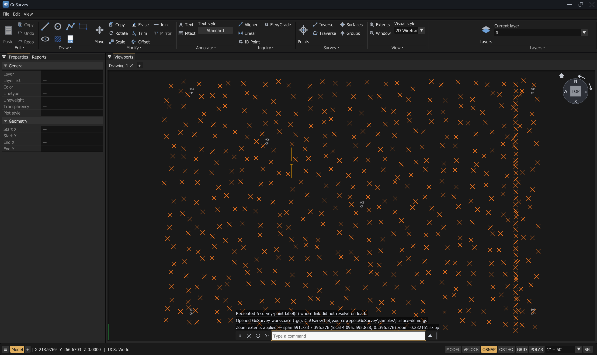
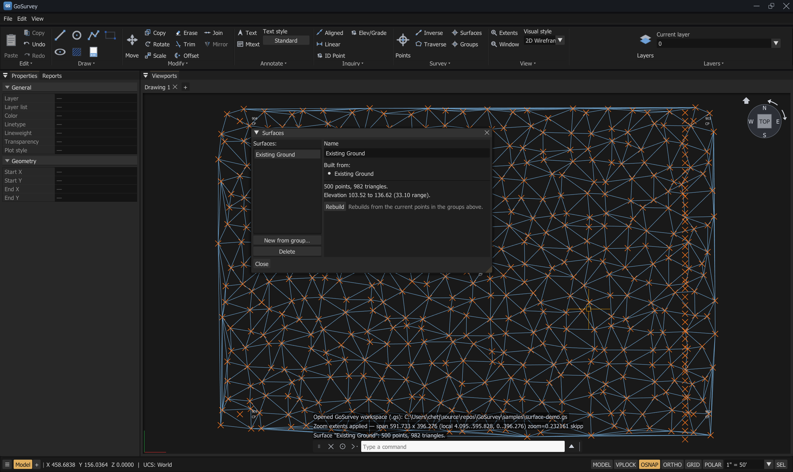
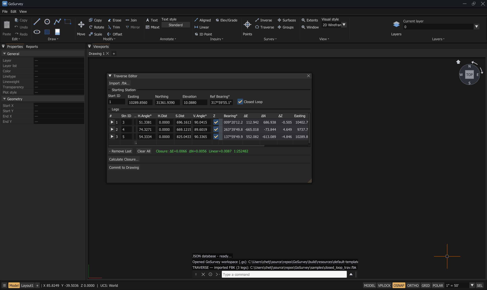
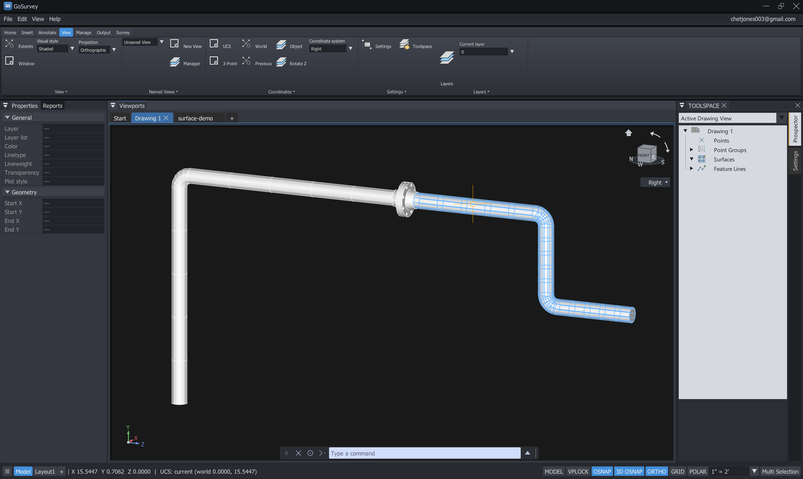

# GoSurvey

**Survey drafting and COGO for Windows.**

GoSurvey is a fast, modern CAD platform built for land surveyors. Draw linework in bearings and distances, manage a survey-point database, reduce raw field observations, build TIN surfaces, align local coordinates to state plane, and plot turnover sheets — with exchange to AutoCAD and Civil 3D through DXF, DWG, and CSV.

---

## What it does

GoSurvey covers the work between the field book and the recorded turnover:

| | |
|---|---|
| **Drafting** | Lines, polylines, arcs, circles, text, dimensions, hatching, layers, blocks, and paper-space layouts with scaled viewports |
| **Survey points** | Numbered points with northing, easting, elevation, description, and labels — kept separate from linework and round-tripped through DXF |
| **Traverse reduction** | Raw Face 1 / Face 2 observations, least-squares closure, residuals, and FBK import |
| **Surfaces** | TIN models from point groups — contours, slope banding, volumes, and 3D orbit |
| **Coordinate alignment** | Helmert fit from control pairs to move a local job onto real-world coordinates |
| **Reference plans** | PDF underlays with snap to visible geometry on the page |
| **Exchange** | DXF and DWG in/out, PNEZD/PENZD CSV, glTF/STL for 3D context |

Type a command or use the ribbon. Every readout follows the units and bearing format you set once.

---

## Screenshots

---

## Download

**[Latest release (Windows x64 installer)](https://github.com/chetjones003/GoSurvey/releases/latest)**

GoSurvey is free to install. After setup it checks for updates on startup and asks before downloading anything. Stable and beta channels are available in *Settings → System → Updates*.

---

## Documentation

Step-by-step guides, command reference, workflows, and troubleshooting live in the **[User Manual (GitHub Wiki)](https://github.com/chetjones003/GoSurvey/wiki)**.

Inside the app, press **F1** or type **`HELP`** to open the same manual.

| Start here | |
|---|---|
| Install and first drawing | [Getting Started](https://github.com/chetjones003/GoSurvey/wiki/Getting-Started) |
| Panels, ribbon, and tabs | [User Interface](https://github.com/chetjones003/GoSurvey/wiki/User-Interface) |
| Every command and alias | [Command Reference](https://github.com/chetjones003/GoSurvey/wiki/Command-Reference) |
| End-to-end tutorials | [Workflows](https://github.com/chetjones003/GoSurvey/wiki/Workflows) |

---

## License

GoSurvey is licensed under **GPL-3.0-or-later** (LibreDWG linkage). See [`installer/License.txt`](installer/License.txt) for full text and third-party notices.

---

## For developers

Source builds use CMake, MSVC, and Ninja on Windows. See [`dev/README.md`](dev/README.md) for the build adapter and contributor workflow.

**[Report an issue](https://github.com/chetjones003/GoSurvey/issues)** · **[All releases](https://github.com/chetjones003/GoSurvey/releases)**
